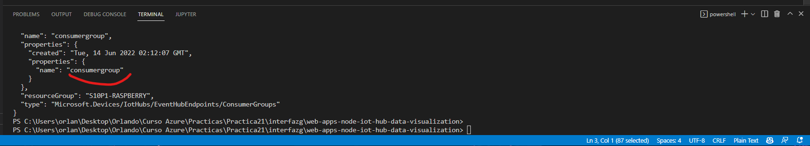

# AZURE - IOT - RASPBERRY
**En esta practica aprenderas a conectar un recurso de IOT de Azure con un Raspberry simulador (Calculador de Temperatura) Desde LOCAL y en AZURE**

## Requisitos
- Tener una suscripcion en Azure
- Tener una conexion a internet
- Tener un navegador instalado (Brave,Google,Firefox, etc)
- Tener un raspberry o en su caso un simulador, te dejo este por [aqui](https://azure-samples.github.io/raspberry-pi-web-simulator/#getstarted)
- Ocuparas este link para poder hacer la conexion por [aqui](https://github.com/Azure-Samples/web-apps-node-iot-hub-data-visualization)

-------------------------

## TUTORIAL

### **DESDE LOCAL**

**1.-Primero nos vamos al Portal de Azure y buscamos en market o en el buscador IOT HUB**

**2.-Le damos lo minimo para crear un recurso en azure**

**3.-Nos adentramos adentro del recurso y nos vamos a devices**

**4-.Le damos esta configuracion, le damos un id y le damos a save**

**5.-Nos vamos a nuestro device ID**

**6.-Y aqui tendríamos las credenciales que utilizaremos mas adelante (copiamos Primary Connection String)**

**7.-Nos vamos a nuestro Raspberry y la pegamos (en este caso como es un simulador la pegamos donde dice cost ConnectionString = "aqui pegamos" y le damos en run**

**8.-Una ves corrido el programa(para prender el rasperry) nos mostrara el sig mensaje: (si te muestra lo mismo o similar vas en buen camino)**

**9.-Ahora nos vamos a este respositorio de [github](https://github.com/Azure-Samples/web-apps-node-iot-hub-data-visualization) descargamos el repositorio y abrimos Visual studio code desde la carpeta del repositorio que descargamos**

**10.-Nos vamos a un una terminal (Por ejemplo desde visual studio code agregamos una terminal) y nos logeamos con el sig comando "az login" y le damos nuestras credenciales (recordando que estamos dentro de la carpeta que descargamos anteriormente)**

**11.- Conectamos nuestro iot hub con el sig comando "az iot connection-string show --hub name "NOMBRE DEL RECURSO IOT" --policy-name service (y nos preguntara si lo queremos hacer y le tecleamos Y)**

**12.-Esperamos a que se instale todo**

**13.-Una vez instalado nos aparecera algo similar a esto (es importante que el HostName y el consumer group lo copies en algun lado ya que lo utilizaremos mas adelante)**

**14.-Ahora tecleamos npm install desde nuestra terminal (en este caso se abrio una terminal en cmd ya que no lo permitia si usted se lo permite desde visual studio code adelante si no abrá un cmd desde la carpeta donde estabamos y tecle lo anteriormente dicho "npm install") y esperamos a que se instale node**

**15.- Una vez que se termine de instalar le aparecera los sig:**

**16.-¿Te acuerdas del paso num 13 donde copiamos el HostName y el consumergroup? Ahora lo necesitaremos,primero: nos vamos al archivo server.js y copiamos esto "IotHubConnectionString" (Del repositorio descargardo, recuerda que todo lo estamos haciendo desde ahi dentro)**

**17.-Ahora nos vamos a nuestra terminal de cmd dentro del repositorio escribimos: "set" espacio "IotHubConnectionString" "=" "HostName" y quedaria de la sig. manera: (Recuerda que el HostName lo sacamos en el paso 13)**

**18.-Nos regreamos al archivo server.js y copiamos ahora "EventHubConsumerGroup"**

**19.-Nos regresamos a la terminal de cmd y tecleamos: "set" espacio "EventHubConsumerGroup" "=" "consumergroup"(Quedaria como en la imagen). Ahora lo siguiente: tecleamos "npm start" y aparecería como en la imagen (si te aparece Listening 3000 significa que funciono!)**

**20.-Aqui puedes ver la imagen completa donde aparecen los datos del Raspberry**

**21.- Y finalmente si nos vamos a un navegador y tecleamos localhost:3000 aparecerá nuestro raspberry calculando la temperatura!**

### **DESDE AZURE**

**22.-Creamos un recurso de App Service desde el portal de Azure (Le damos lo minimo para crear un recurso) Puedes usar esta configuracion si la deseas, puede cambiar para los requerimientos que ocupes. Le das en revisar y en crear.**

**23.-Nos vamos al recurso**

**24.-Nos dirigimos en la parte izquierda y seleccionamos TSL/SSL settings y le damos en on donde viene "HTTPS ONLY"**

**25.-Nos vamos a configuration y activamos lo sig:**

**26.-Ahora nos dirigimos a Deployment Center en FTPS credentials y le damos un username, password y confiramos el password, despues lo guardamos**

**27.-Ahora nos Settings y conectamos nuestro git**

**28.-Abrimos una terminal y tecleamos "git remote add webapp link"(El link esta en los requerimientos) le damos enter y despues "git remote -v" le damos enter**

**29.-Ahora tecleamos "git branch * master" y le damos enter**

**30.-Ahora tecleamos: "git push webapp master:master"**

**31.-Nos dirigmos al recurso y nos vamos a configuration, damos en Application settings, New application settings**

**32.-Le damos un nombre como "IotHubConnectionString" el Value como lo siguiente (recuerda que esto lo sacas haciendo el paso num 13)**

**33.-Le damos lo mismo con el consumergroup**

**34.-Ahora nos vamos al recurso, en overview y entramos al url**

**35.-y como podrás ver si entramos a la url ya esta en funcionamiento!**

